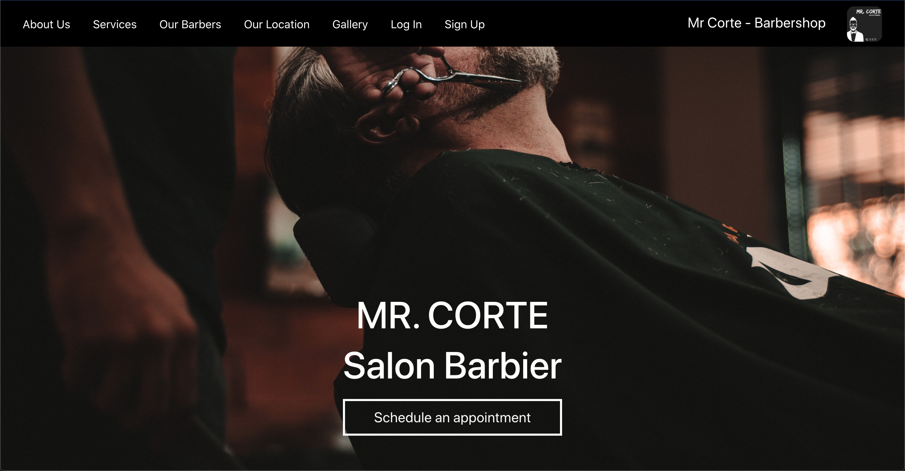
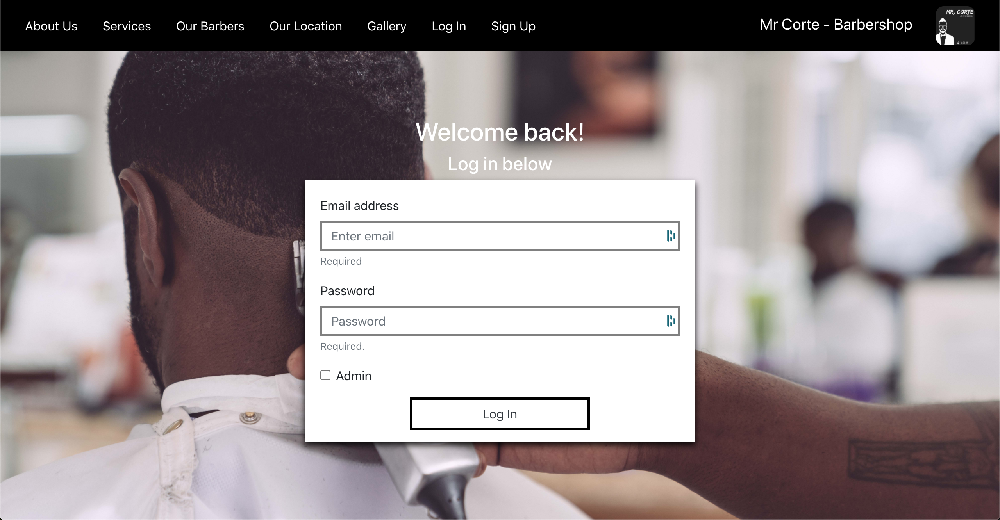
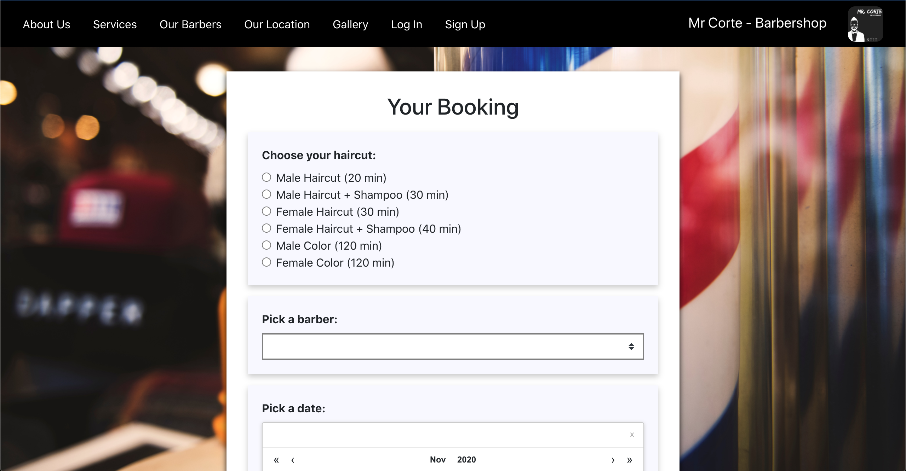
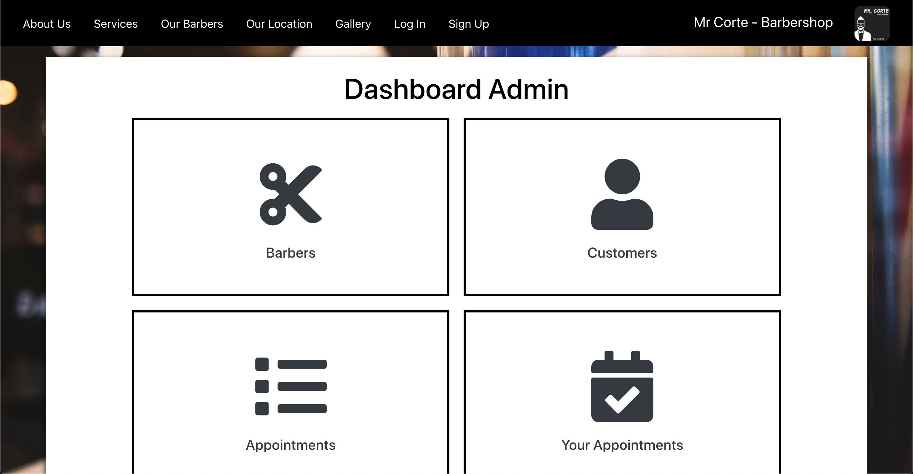
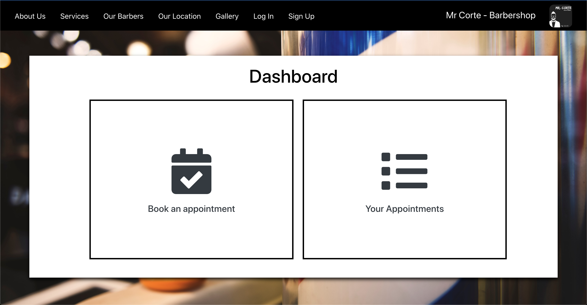

## Mr. Corte Barbershop - Booking System

This project is a fully functional appointment booking system in the context of a barbershop in Montréal. This is the front-end part of the project.
You can find the back-end at the following link: https://github.com/gautiermarechal/server_mr_corte

## Technologies used

### Front-End

- React
- Bootstrap
- React Calendar

### Back-End

- Node.js
- Express
- Mongoose

### Database

- MongoDB

## How to run it?

Make sure to have an up-to-date version of Node.js before.

## Download the zip file

## `cd booking-appointment-system-m-corte`

## `npm start`

The project will run on localhost:8000

## Screenshots

